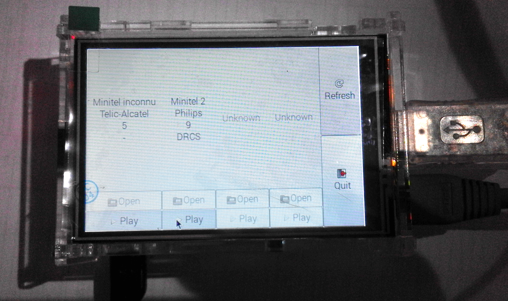

MiPlayer
========

MiPlayer is a small "Minitel Media Center" :-)

It aims to connect up to 4 Minitels to a Raspberry Pi and send them Videotex
files continuously.

Requirements
------------

- GNU/Linux distribution
- up to 4 Minitels
- one USB to TTL cable per Minitel
- one Raspberry Pi (version 2 or above needed for 4 Minitels setup)
- a screen connected to the Raspberry Pi (in my case, it is a small touch
  screen)

The GNU/Linux distribution has to be able to automatically detects the USB to
TTL cables and assign them to /dev/ttyUSB0, /dev/ttyUSB1 etc.

You must also be sure that the application user will have the necessary rights
to read and write to these devices.

The application is meant to be run on a small touch screen (480×320) which
explains why it goes fullscreen.

Photo
-----

